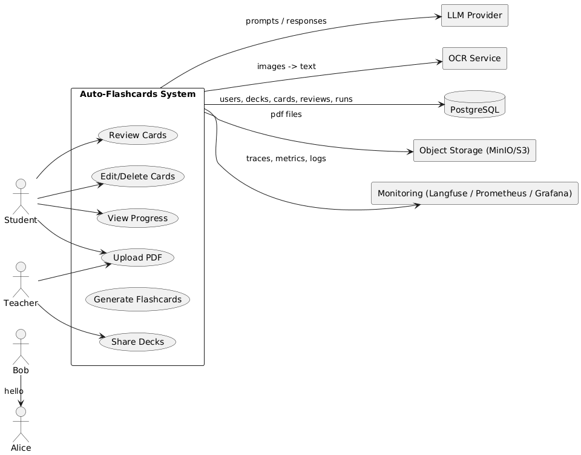
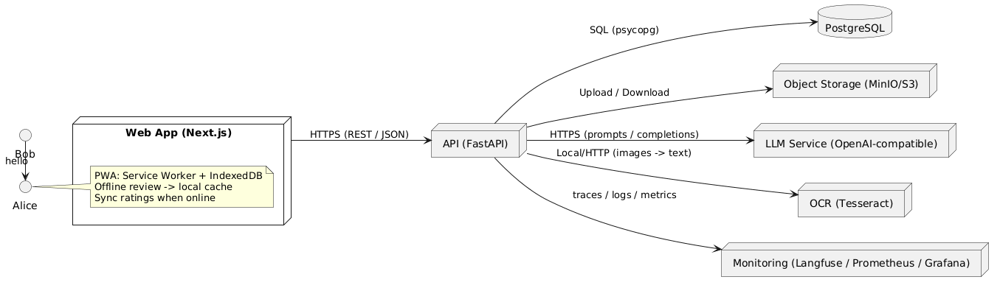

# Auto-Flashcards — Архитектура (C4 Diagrams)

## 1. Контекстная диаграмма

Диаграмма показывает систему Auto-Flashcards как «чёрный ящик» и её взаимодействие с пользователями и внешними сервисами.

- **Пользователи**: Студент и Преподаватель.
- **Система**: Auto-Flashcards (загрузка PDF, генерация карточек, повторение, редактирование, панель прогресса, шаринг).
- **Внешние сервисы**: LLM-провайдер (OpenAI), OCR-сервис (Tesseract), БД (PostgreSQL), объектное хранилище (MinIO/S3), мониторинг (Langfuse, Prometheus, Grafana).

---

## 2. Диаграмма контейнеров

Диаграмма показывает внутренние компоненты системы и связи между ними.

- **Web App (Next.js)** — фронтенд-приложение, работает как PWA с offline-режимом (IndexedDB + Service Worker).
- **API (FastAPI)** — backend-сервис, обрабатывающий запросы и связывающий фронтенд с БД, OCR и LLM.
- **PostgreSQL** — основная реляционная база данных.
- **Object Storage (MinIO/S3)** — хранилище PDF-файлов.
- **LLM Service** — внешний сервис генерации карточек.
- **OCR (Tesseract)** — сервис распознавания текста из сканов.
- **Monitoring** — Langfuse, Prometheus, Grafana для трассировки, логов и метрик.

---

## 3. Обоснование выбора технологий

- **Next.js (Frontend):** современный React-фреймворк с SSR, удобная интеграция с REST API, поддержка PWA.
- **FastAPI (Backend):** быстрый Python-фреймворк, простая интеграция с ML/LLM, встроенный OpenAPI/Swagger.
- **PostgreSQL:** надёжная реляционная БД, поддержка JSONB для хранения LLM-трассировок.
- **MinIO/S3:** объектное хранилище для больших файлов (PDF).
- **Tesseract:** проверенный OCR для извлечения текста.
- **LLM Provider (OpenAI):** генерация карточек «Вопрос–Ответ».
- **Langfuse + Prometheus + Grafana:** полный стек мониторинга качества и стоимости.

---

## 4. Интерфейсы компонентов

- **Web → API:** HTTPS (REST/JSON), JWT авторизация.
- **API ↔ DB:** SQL-запросы к PostgreSQL (users, decks, cards, reviews, runs).
- **API ↔ LLM:** HTTPS-вызовы (prompts/completions), логирование latency и cost в Langfuse.
- **API ↔ OCR:** локальный сервис OCR.
- **API ↔ MinIO:** загрузка и чтение PDF через S3-протокол.
- **API ↔ Monitoring:** отправка метрик и логов, health-check endpoints (api, db, llm).
